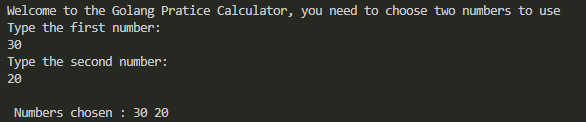
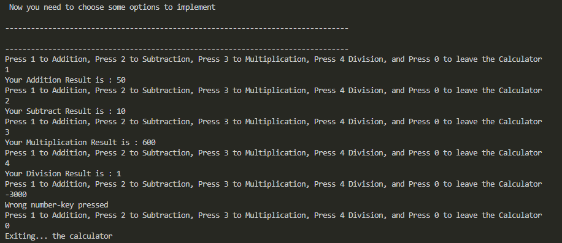

<h2>Technologies: </h2>

Golang

Visual Studio Code

<h2>The Project in Execution:</h2>
<h4>Main menu</h4>

<h4>Operations</h4>

<h5>If you want to try the project, just clone and open a terminal, and -> go run main.go</h5>
